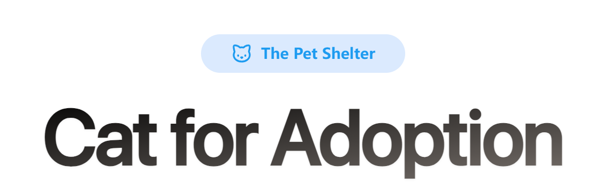
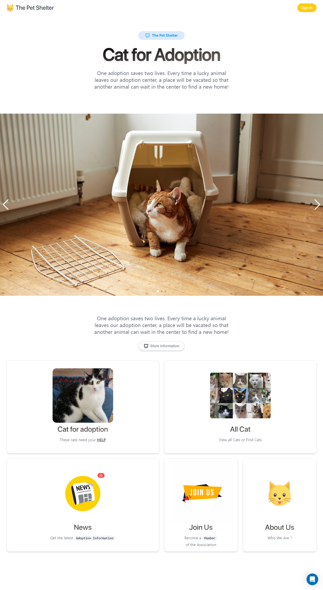
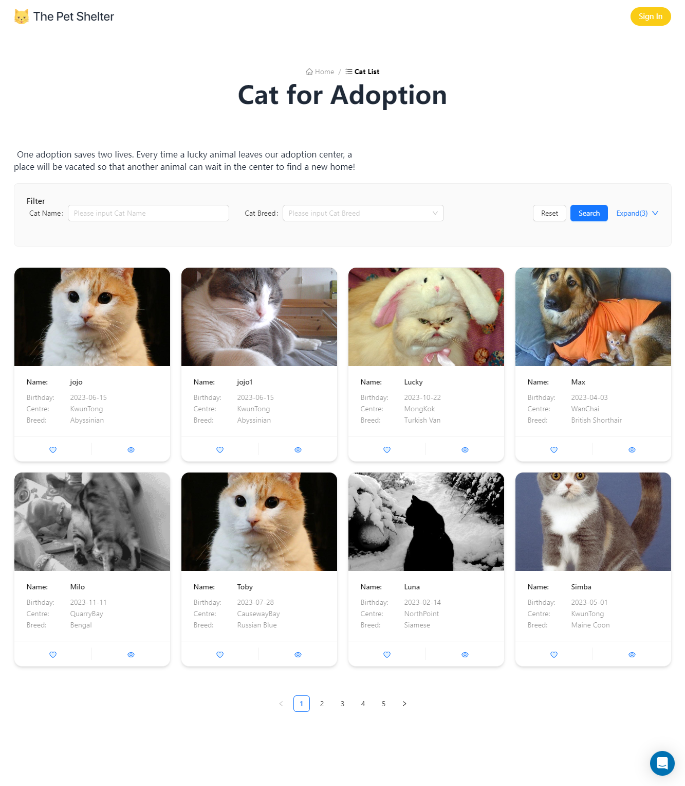
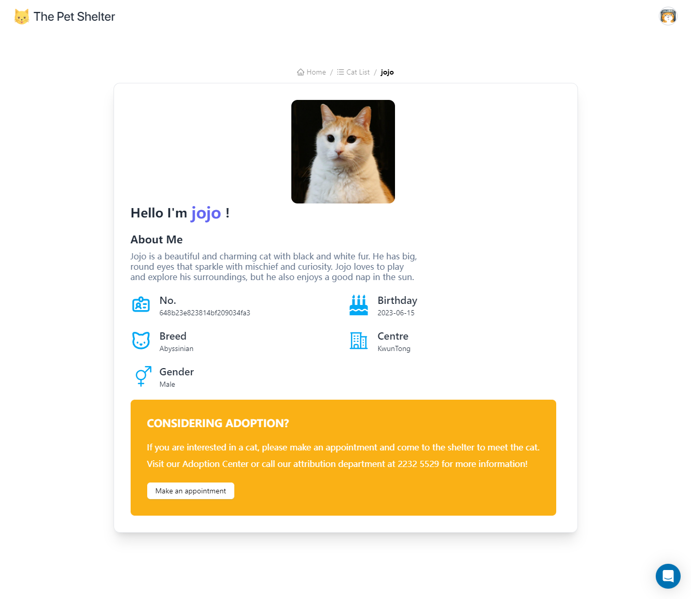
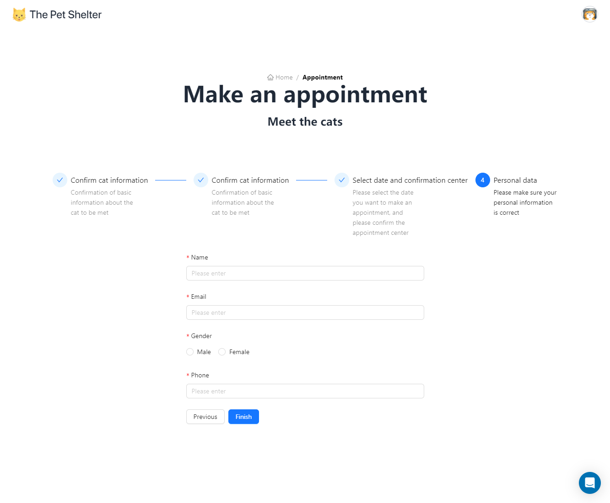
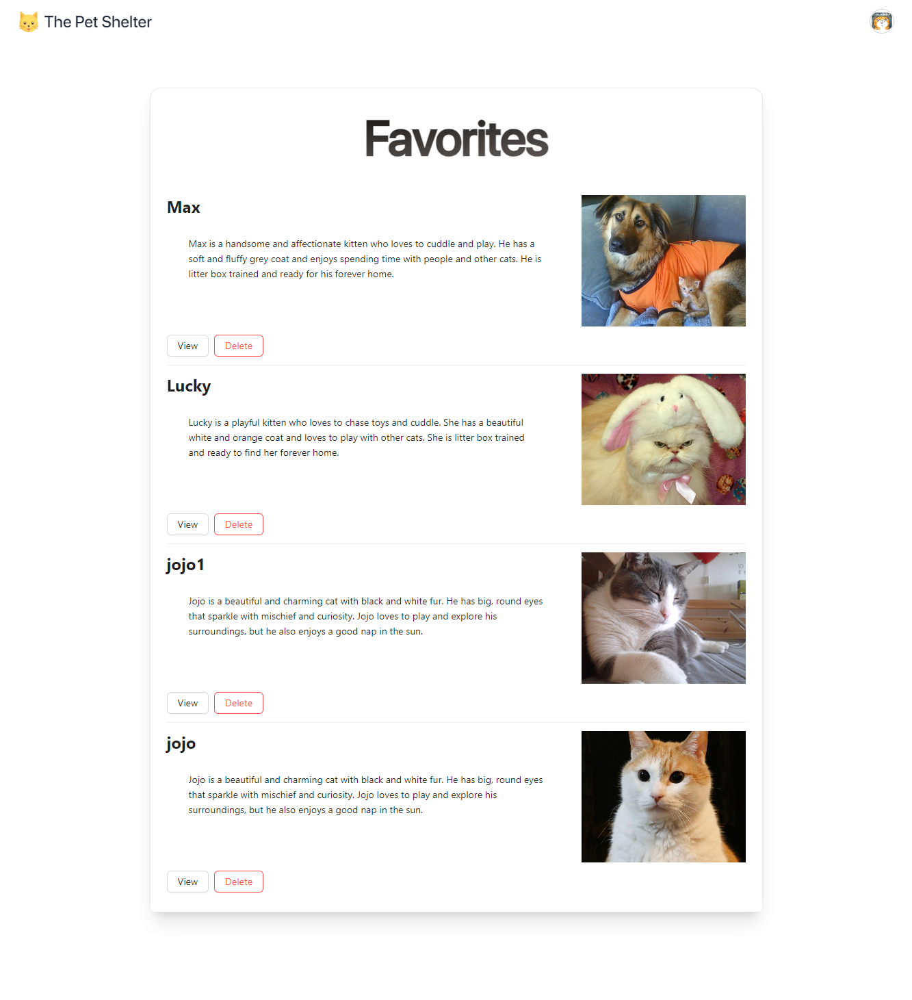
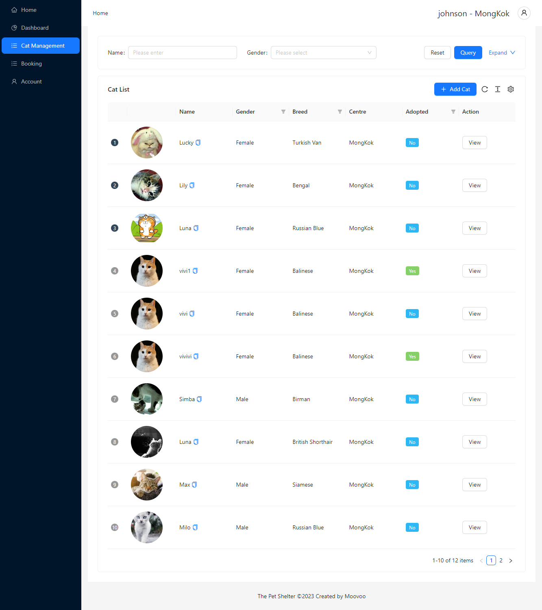

<a href="https://6003-cem-webapi-frontend.vercel.app/">
  
  <h1 align="center">6003-CEM-WEBAPI PROJECT</h1>
</a>

<p align="center">
  Live Demo
</p>

<p align="center">
  <a href="https://6003-cem-webapi-frontend.vercel.app/"><strong>Demo</strong></a>
  <br />
  OR
  <br />
  <a href="https://6003-cem-webapi-frontend.vercel.app/"><strong>https://6003-cem-webapi-frontend.vercel.app/</strong></a>
</p>
<br/>

## Introduction

This is a web application for matching shelter cats with new owners. It also comes with back office management. Backend using Nest.js [Github](https://github.com/kjjkjjzyayufqza/6003CEM-WEBAPI-BACKEND).

## How to run

```bash
npm i
```

```bash
npm run dev
```

## Features

- **Show/search/filter cats** : Use filters (breed, name, adopted or not), to view cat details.

- **News** : When a new cat is added, a relevant news item is automatically created on the page.

- **Membership** : Available for registered users and staff (code required), registered users can perform more operations, such as making appointments, and updating personal information.

- **Favorites** : Registered users can add any favorite cats to their list and also support editing.

- **Reservation** : Registered users can make an appointment to meet with a specified cat at the shelter. At the same time, you can view the past appointment records on the webpage.

- **OAuth 2.0** : Support login with Google account.

- **Back Office Management** : Staff can add, modify, delete cats and update their personal information. Also can view user appointments

- **Authentication management** : Authentication through the backend [Github](https://github.com/kjjkjjzyayufqza/6003CEM-WEBAPI-BACKEND)

- **Restrictions** : Staff will be asked to provide a code when registering, the code represents the shelter area, staff can only operate according to that shelter area after registration, including getting data and updating data. Staff data from different shelter areas are not interchangeable.

- **Additional** : Users can ask the online staff for cat details in real time on the webpage.

### Frameworks

- [Next.js](https://nextjs.org/) – React framework for building performant apps with the best developer experience
- [Auth.js](https://authjs.dev/) – Handle user authentication with ease with providers like Google, Twitter, GitHub, etc.

### Platforms

- [Vercel](https://vercel.com/) – Easily preview & deploy changes with git
- [Vercel Postgres](https://vercel.com/postgres) – Serverless Postgres at the Edge

### UI

- [Tailwind CSS](https://tailwindcss.com/) – Utility-first CSS framework for rapid UI development
- [`next/font`](https://nextjs.org/docs/basic-features/font-optimization) – Optimize custom fonts and remove external network requests for improved performance
- [`ImageResponse`](https://beta.nextjs.org/docs/api-reference/image-response) – Generate dynamic Open Graph images at the edge
- [`react-wrap-balancer`](https://github.com/shuding/react-wrap-balancer) – Simple React component that makes titles more readable
- [`ant-design`](https://github.com/ant-design/ant-design) – An enterprise-class UI design language and React UI library.

## Author

- Moovoo ([@Moovoo](https://github.com/kjjkjjzyayufqza))

## Screen











